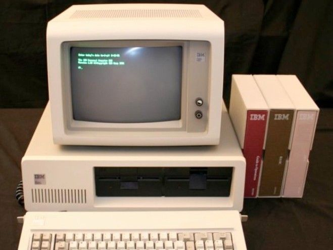

# *DH-Heroes*

## Introducción

Hasta el momento, nuestros "inversores" han quedado maravillados con el trabajo. Pues se
han dado cuenta que hemos podido llegar a destino tal como se esperaba. Y, si bien son
conscientes de que ha costado un poco, saben que el viejo dicho "la práctica hace al
maestro" se ajusta perfectamente a este escenario. Es por ello que ahora ponen en nuestro
camino otro pequeño desafío, el cual seguramente lograremos cumplir.

En esta oportunidad, quieren hacer un sencillo sitio usando la tecnología de Express.

Este sitio busca mostrar de manera simple la información de las Heroínas y los Héroes
Tecnológicos más representativos del ámbito de la programación.

El cliente proveerá todas las imágenes y los archivos HTML y CSS ya listos para su
utilización en la página web. Nuestra misión será crear un servidor web con Express y
colocar todos estos recursos donde correspondan, para navegar a través de ellos.
Así que, sin más preámbulos, dejamos aquí las consignas para este desarrollo.

## Objetivo

Para la construcción de este pequeño sitio web se espera contar con la posibilidad de
acceso a las siguientes URLs:

- / -> Debe direccionar al recurso index.html.
- /babbage -> Debe direccionar al recurso babbage.html
- /berners-lee -> Debe direccionar al recurso berners-lee.html.
- /clarke -> Debe direccionar al recurso clarke.html.
- /hamilton -> Debe direccionar al recurso hamilton.html.
- /hopper -> Debe direccionar al recurso hopper.html.
- /lovelace -> Debe direccionar al recurso lovelace.html.
- /turing-> Debe direccionar al recurso turing.html.

¡Atención! Las anteriores deberán ser direcciones de acceso a la aplicación desde el navegador.

## M4 C10

## Ubicación -> Programación/TRABAJOS PRACTICOS/Heroes de la computacion